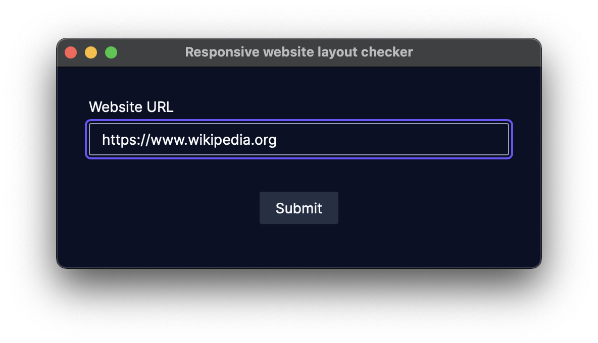
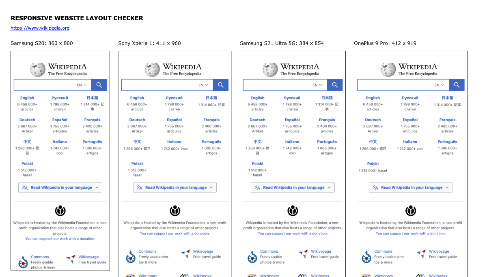

# Responsive website layout checker

Captures screenshots of the given website in multiple [common viewport sizes](https://yesviz.com/viewport/) and creates an HTML report.



```
==============================================================================
Tasks :: Responsive website layout checker. Reports website layout in diffe...
==============================================================================
Report website layout in different viewport sizes
https://www.wikipedia.org
Samsung S20: 360 x 800
Sony Xperia 1: 411 x 960
Samsung S21 Ultra 5G: 384 x 854
OnePlus 9 Pro: 412 x 919
...
```


